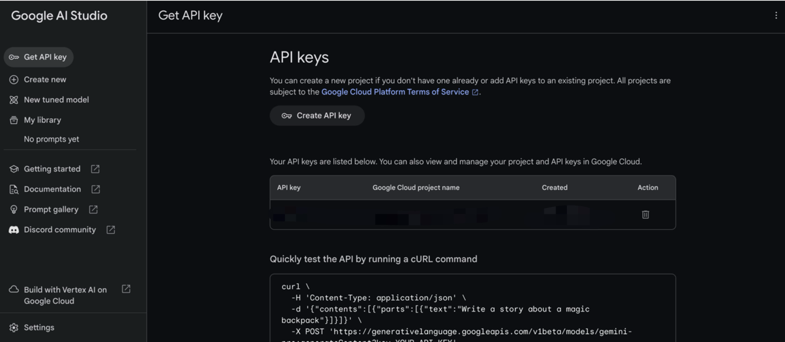
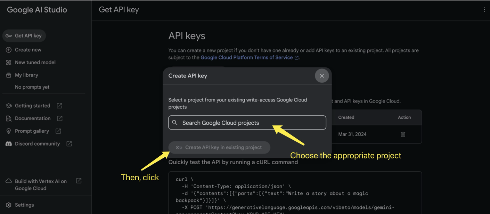
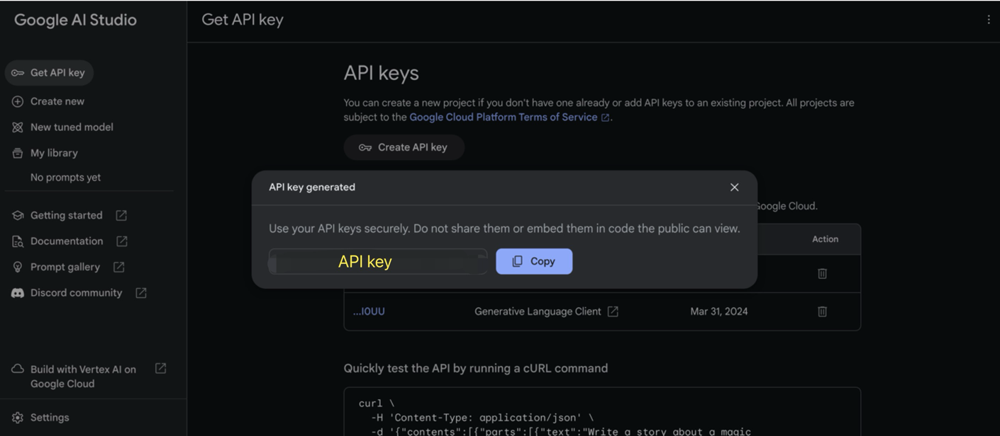

# Indeed Resume and Job Summarizer
This program streamlines job searching by leveraging the power of Gemini's AI. It begins by processing your PDF resume to extract key information. Gemini then identifies relevant job titles and locations, which are used to query Indeed.com. The program retrieves the top 5-10 results, scrapes their text, and uses Gemini's AI again to generate concise summaries of job descriptions, salary expectations, and required skills. This sophisticated tool significantly reduces the time and effort involved in finding suitable job opportunities. The entire process, from resume analysis to summarized job details, is powered by the advanced capabilities of Gemini's AI, providing a seamless and efficient job search experience.

# Features
* Extract text from PDF
* Saves the extracted content in a text file
* Uses Gemini's AI to help find job listings and locations
* Extracts content from HTML structured websites
* Uses Gemini's AI fetures to summarize job descriptions, locations, and pay

# Supported Websites
The program currently supports downloading content from the following job listing websites:

* Indeed.com

# Installation

1. Clone the repository
```ruby
git clone https://github.com/jbrowbb/CS325_project.git
```

2. Navigate to the project directory
```ruby
cd 'Indeed Project'
```

3. Initialize the conda environment with the provided `requirements.yaml` file
```ruby
conda env create -f requirements.yaml
```

4. Activate the conda environment
```ruby
conda activate job_matching_env
```

# Usage
1. Create a folder called Resume that contains your pdf version of your resume, resume.txt (the location of the scraped pdf resume), and summarized_resume.txt (location for the summarized resume, job titles, and locations)

2. Create a folder called Jobs. Inside that folder create two folders and a text file. The folders should be named Original (holds the original content from Indeed) and Summarized (holds the summarized version of the jobs). The text file's name is urls.txt and contails the Indeed URLs of the job listings. Each URL needs to be on a separate line.

3. For using Gemini's AI system, you need to create the API key/token. Create your account using [Google AI Website](https://ai.google.dev/) first.

4. Then create the personal unique API key [API key/token](https://aistudio.googl.com/app/apikey).

a. The main API Key page.
    

b. Click `Create API key`
    

c. You will see you API key
    